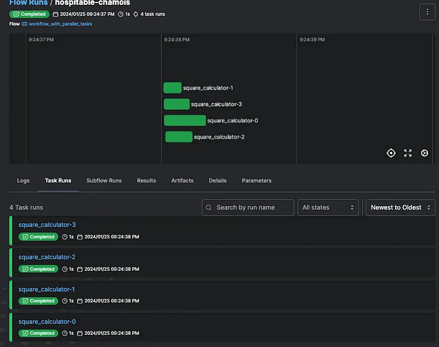

# Test and Validate data pipelines/workflows with Prefect

Using non standard test automation tool Prefect to Test and Validate your data pipelines.

<!-- more -->

[**Published on Medium**](link: https://medium.com/@vicky.guo97/test-and-validate-data-pipelines-workflows-with-prefect-cc24bb557571)

## Describing the problem I faced

AI is presently a day-to-day hot topic in today’s world. Naturally, data is a crucial component of AI models and products. For this reason, most companies create their own data pipeline/workflow to manage their data for when building their AI models or future data analysis.

As we know, data pipelines can be complex and overwhelming, requiring significant time and effort to ensure the quality of all related services and data for the development team. The recent project I attended put me into that spot, I started asking myself some questions:

When it comes to API-level testing and end-to-end integration testing for data-driven products, we always rely on mainstream automation testing platforms or tools, which require endless efforts to implement and maintain. However, is there a different solution that can give us the same outcome but enhance the efficiency and extensibility of validating data workflows/pipelines?
Except for the main purpose of testing and validation, could we explore additional functionality through this solution?
I always believe the combination of in-house innovation and open-source collaboration can be a powerful driver of progress and competitiveness for large corporations or any company. But How?

## The Desired Solution

While the Modern Data Stack continuously grows and provides a lot of flexibility with the various components that play well with each other, open-source orchestration tools like Apache Airflow, Prefect, Argo, and Kubeflow give you more options to fit different purposes.

After conducting some research and comparison, I have set my sights on Prefect platform. This article won’t be an introduction to Prefect, You can get more details about Prefect from [here](https://www.prefect.io/).


### Here are some reasons why I chose it:
* Prefect is a modern workflow orchestrator platform, that makes it easier to create, deploy, and monitor tasks. With the help of an orchestrator, teams can quickly build repeatable processes that are easy to run remotely, observe, and troubleshoot if they fail.

* Prefect would be suitable if you need to get something lightweight up and running as soon as possible.

* Prefect offers a comprehensive UI dashboard that provides all the necessary information related to flows and tasks, work pool details, and workflow logs.

* Additionally, Prefect offers both cloud-hosted and self-hosted deployment strategies, allowing users to maintain it using their own CI/CD pipeline, providing greater flexibility.

* Prefect integrations are structured as collections of pre-built tasks, flows, blocks, and more, which can be easily installed as PyPI packages. They offer many popular extensive capabilities.

## Solution: How to use Prefect for testing and data pipeline validation

Prefect have two key concepts **Tasks** and **Flows** you should know.

* Tasks: Discrete units of work in a Prefect workflow.

* Flows: A Prefect workflow, defined as a Python function.

Here is my idea,

* Define task units as each of my API entry points.

* Define flows to invoke different combinations of tasks to represent different data workflows.

This would easily include regular or customized data workflow, Additionally, this approach could streamline your workflow, enhance code readability and most importantly to focus on business requirements.

### Sample Code : Task
* You can almost effortlessly include all REST API CRUD operations as tasks, such as GET, CREATE, UPDATE, DELETE API entry points.


* Let’s check what a User GET entry point (task) would look like. It’s just a normal python http request function with Prefect task respective decorator.

```
@task(name="get_user_task", description="get user information", log_prints=True)
def get_user_task(api_token: str, user_id: str) -> dict:
    """
    :param api_token:
    :param user_id:
    :return:
    """
    logger = get_run_logger()
    dict_result = {}
    request_headers = {"Authorization": f"Bearer {api_token}",
                       "content-type": "application/json"}
    try:
        response = requests.get(USER_API_URL, headers=request_headers, params={"user_id": user_id})
        dict_result["status_code"] = response.status_code
        dict_result["result"] = json.loads(response.content)
        if response.status_code!=200:
            logger.warning("failed to get user information, error: %s", response.content)
    except Exception as err:
        dict_result["status_code"] = 502
        dict_result["result"] = str(err)
        logger.error("get_user_task request failed, error: %s", err)

    return dict_result
```

### Sample Code : Flow
* Let start by defining a Prefect flow now. below is one simple flow which will get a existing user -> create a new user -> update the user -> delete the user at last.

```
@flow(name="user_api_workflow_test", log_prints=True, task_runner=SequentialTaskRunner())
def user_api_workflow_test():
    print("Start test user API workflow ")
    # Read test case configuration file
    dict_test_case = utility.get_test_case_config_info(TEST_CASE_FILE_PATH)

    # Go through each test case
    for test_case_id in dict_test_case:
        print("Task 1: Get Existing user")
        exist_user_id = dict_test_case[test_case_id]["user_id"]
        dict_result = user_api_task.get_user_task(exist_user_id)
        if dict_result["status_code"] == 200:
            print("Test Passed! This user info : ", dict_result["result"])
            case_result = "Passed"
        else:
            print("Test Failed! Failed to create a new user")
            case_result = "Failed"

        TEST_RESULTS.append({'Test Case ID': test_case_id, 'Test Task Description': "Task 1: Get Existing user",
                             'Test Result': case_result})
        new_user_id = ""
        print("Task 2: Create a new user")
        new_user_info = utility.get_json_data(dict_test_case[test_case_id]["new_user_json_path"])
        dict_result = user_api_task.create_user_task(new_user_info)
        if dict_result["status_code"] == 201:
            print("Test Passed! New User info : ", dict_result["result"])
            new_user_id = dict_result["result"]["user_id"]
            case_result = "Passed"
        else:
            print("Test Failed! Failed to create a new user")
            case_result = "Failed"

        TEST_RESULTS.append({'Test Case ID': test_case_id, 'Test Task Description': "Task 2: Create a new user",
                             'Test Result': case_result})

        print("Task 3: Update existing user")
        update_user_info = utility.get_json_data(dict_test_case[test_case_id]["update_user_json_path"])
        dict_result = user_api_task.update_user_task(new_user_id, update_user_info)
        if dict_result["status_code"] == 200:
            print("Test Passed! Success update user info")
            case_result = "Passed"
        else:
            print("Test Failed! Failed to Update the user")
            case_result = "Failed"

        TEST_RESULTS.append({'Test Case ID': test_case_id, 'Test Task Description': "Task 3: Update existing user",
                             'Test Result': case_result})

        print("Task 4: Delete existing user")
        dict_result = user_api_task.delete_user_task(new_user_id)
        if dict_result["status_code"] == 200:
            print(f"Test Passed! User {new_user_id} have been deleted")
            case_result = "Passed"
        else:
            print("Test Failed! Failed to delete the user")
            case_result = "Failed"

        TEST_RESULTS.append({'Test Case ID': test_case_id, 'Test Task Description': "Task 4: Delete existing user",
                             'Test Result': case_result})

        utility.create_result_artifact_table("user api workflow", test_case_id, TEST_RESULTS)

    print("Finish test User API workflow")

if __name__ == "__main__":
    user_api_workflow_test.serve(name="user_api_workflow")
```

* Let’s see what would looks like in Prefect UI after executed this user API workflow:


>***Just reminder, Both workflow and Tasks share some common features that’s would be benefits us:***

>1. ***Both are defined easily using their respective decorator, which accepts settings for that flow / task (see all [task settings](https://docs.prefect.io/latest/concepts/tasks/#task-arguments) / [flow settings](https://docs.prefect.io/latest/concepts/flows/#flow-settings)).***
>2. ***Each can be given a name, description and tags for organization and bookkeeping.***
>3. ***provide functionality for retries, timeouts, and other hooks to handle failure and completion events.***

### Sample about Task Runners in parallel

Many real-world data workflows benefit from true parallel, distributed task execution. For these use cases, Prefect Integrations offers Prefect-developed task runners for parallel task execution as below:

* **DaskTaskRunner**: runs tasks requiring parallel execution using dask.distributed.
* **RayTaskRunner**: runs tasks requiring parallel execution using Ray.

This provides us with the opportunity not only to conduct data workflow/pipeline testing but also to explore performance testing capabilities by executing certain tasks in parallel. Below is sample code for parallels workflow:

```
@task(name="square_calculator", description="square calculator", log_prints=True)
def square_calculator(input_data_1: int):
    square = input_data_1 ** 2
    print(square)


@flow(name="workflow_with_parallel_tasks", task_runner=DaskTaskRunner())
def workflow_with_parallel_tasks(data_list: list):
    for data_item in data_list:
        square_calculator.submit(data_item)


if __name__ == "__main__":
    input_list = [10, 15, 20, 25]
    workflow_with_parallel_tasks(input_list)
```

* Let’s see parallel tasks processed in Prefect UI


### Test Case and Test Data Management
For testing and data validation purposes, it’s essential to have a flexible and straightforward path for maintaining test cases and test data. Prefect is a data orchestration tool, but it does not provide any build in solution for management test case and test data. I define my own approach by create YAML file to present test cases, include test data in JSON files.

* below is sample of **user_workflow.yaml** test case:

```
test-scenario-1:
  user_id: "1"
  new_user_json_path: "../test_data/new_user_1.json"
  update_user_json_path: "../test_data/update_user_1.json"
test-scenario-2:
  user_id: "2"
  new_user_json_path: "../test_data/new_user_2.json"
  update_user_json_path:  "../test_data/update_user_2.json"
```

* below is sample of **new_user_1.json** test case:
```
{
  "user_id": "1",
  "name": "user_1",
  "phone_number": "123-456-7890"
}
```

> Think about this, by creating a common set of functions dedicated to reading test cases and extracting test data from JSON files. 
> The beauty of this >approach lies in its simplicity — any new test case or test data can effortlessly be placed into a designated folder. 
> This enables the seamless addition of a multitude of data-driven test scenarios without the need to delve into the workflow or tasks code.

### Deployment, CI/CD and Schedule

Prefect offers benefits and features on deployment strategy, deploying a flow exposes an API and UI so that you can:

* trigger new runs, [cancel active runs](https://docs.prefect.io/latest/concepts/flows/#cancel-a-flow-run), pause scheduled runs, customize parameters, and more.
* remotely configure schedules and automation rules for your deployments.
* dynamically provision infrastructure using [workers](https://docs.prefect.io/latest/tutorial/workers/).


> Now you will be able to control or schedule when you execute tests, or easily implement test automation.

### Extra Bonus Functionality: Monitoring, Logs and Artifacts

* Prefect enables you to log a variety of useful information about your flow and task runs, capturing information about your workflows for purposes such as monitoring, troubleshooting, and auditing. This give us good information for testing step process.
* Prefect Artifacts which are formatted outputs rendered in Prefect UI, such as markdown, tables, or links. OK, now I decide to reused to track my test result summary for each time execution.


>I will put sample code on my GitHub, you could be able try this by yourself. It would include detail instructions on how to set up your own Prefect instance on your local machine. Please access the [GitHub repository](https://github.com/VickyGuo0907/prefect-poc-project/) for details.

### Summary of Thoughts after this experiment
* It’s pretty simple and quick for me to create many customized workflows to test all kinds of scenarios right way, take advantage of all benefits and features build in Prefect. That’s big win for fast-paced development life cycle.
* The product I worked on only support define and trigger its data pipelines/workflows through the User Interface, It’s maybe more practical to provide orchestration capability allow clients to automation their processes. Now this experiment could give us a starting point for this feature.
* I believe this experimental project would also be flexible enough to adapt to clients’ environments for testing and validation with every upgrade or new production release.

There would have more to explore with Prefect and other Open Source platform/tools, I would like to discuss with you further.

Happy Coding and Happy Life!

